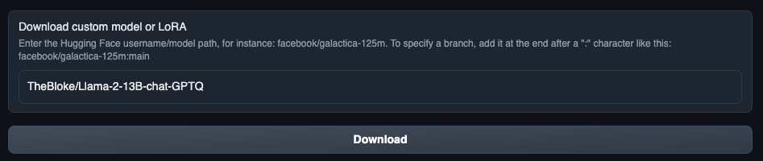
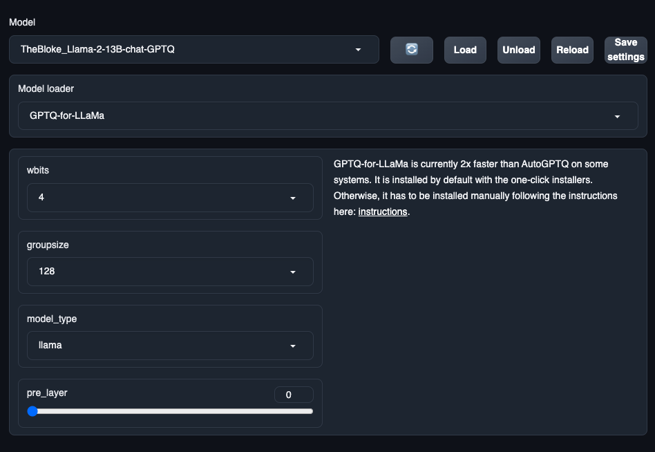
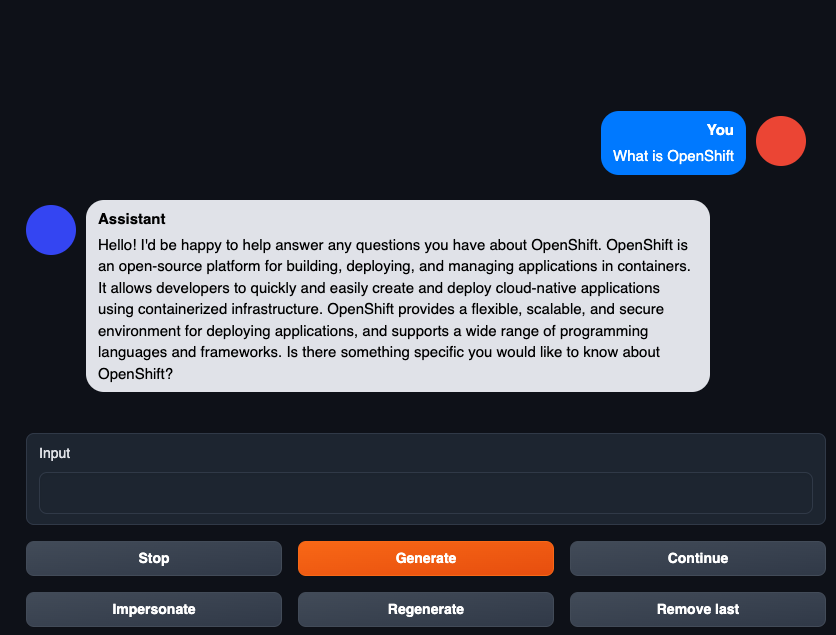

# Text generation web UI on OpenShift

This repository shows how to deploy [Text generation web UI](https://github.com/oobabooga/text-generation-webui) on OpenShift and provides example yamls.

## Prerequisite
* OpenShift Cluster  
  The cluster must include at least one GPU node that has enough vRAM to load LLM. For example, if you are using AWS g5.4xlarge (A10G, 24GiB), this can load [Llama-2-13B-chat-GPTQ](https://huggingface.co/TheBloke/Llama-2-13B-chat-GPTQ). The use of spot instances is recommended to save costs.

* NFD / GPU Operator  
  These operators need to be installed and their CRs should be created to use the GPU on the cluster.

## Deployment

Clone this repository and deploy the yamls under manifests directory.
It will create `text-gen` project on the cluster and other resources. 
```
git clone https://github.com/JPishikawa/text-generation-openshift

cd text-generation-openshift
oc apply -f manifests/
```

Get the URL to access the WebUI.
```
echo https://$(oc get route text-generation-webui -o "jsonpath={.spec.host}" -n text-gen)
```

## Loading Model
When you access the WebUI first time, there are no models loaded, so you need to download and load the model.  

Open the model tab and enter the model repository name from HuggingFace.  
(e.g. TheBloke/Llama-2-13B-chat-GPTQ) 


Once the download completes, select that model and hit the load button.   


When the model is loaded successfully, you can start chatting.


